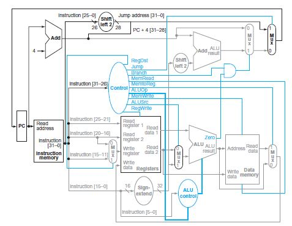
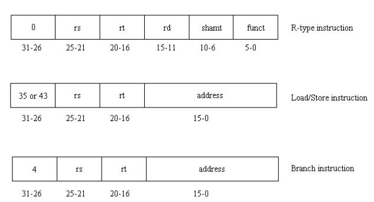
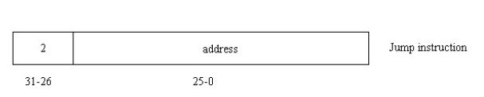

# RISC-Processor

In this project, I have built a structural VHDL implementation of a single-cycle reduced instruction set computer (RISC) processor.

</img>

These are some of the instructions supported:

* Memory-reference instructions such as load word and store word
* Arithmetic logic instructions such as addition, subtraction, and, or and set-less-than
* Control flow instructions such as branch-equal-to and jump

</img>
</img>

**MIPS instruction format**
